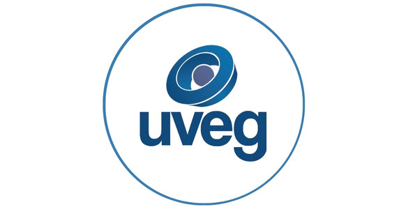
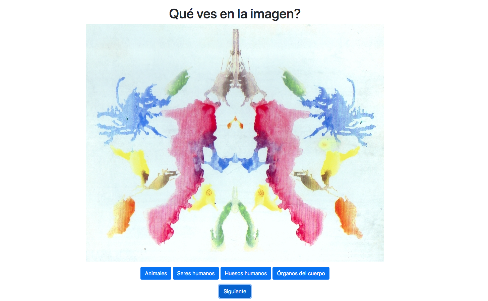

<!-- Generado con https://rahuldkjain.github.io/gh-profile-readme-generator/ -->
<h1 align="center">Hola, Soy Alejandro</h1>
<h3 align="center">Me apasiona la informática</h3>

- 🔭 ACTUALMENTE TRABAJO EN TEST PSICOLGÓGICOS https://al-iskander2.github.io/Test-Psicologico/

- 🌱 ESTUDIOS  Certificación HarvardX Cs50 
  
              Ing. Sistemas Computacionales UVEG 
  

- 👨‍💻 OTRO DE MIS PROYECTTOS https://al-iskander2.github.io/Seguridad-interior-Jane/ 

- 📫 PUEDES CONTACTARME EN **dev.alejandro5@gmail.com**

<h3 align="left">🛠 Language and tools</h3>

###

  

    
     C
  

  

    
     Python
  

  

    
     MySQL
  

  

    
     SQLite
  

  

    
     HTML5
  

  

    
     CSS3
  

  

    
     JavaScript
  

  

    
     Flask
  

<pre></pre>

  
  
  

###

<h3 align="left"></h3>

###

## 📹 Vídeos favoritos de mi [Youtube](https://www.youtube.com/@palabraconexavirtual9758) 

###
<h4>

  Test psicológico | Try it: https://al-iskander2.github.io/Test-Psicologico/
  
</h4>

  

###

<h1 align="center">hey there 👋</h1>

## 👉 Sobre mí
Soy un **Desarrollador**  centrado en Cyber Seguridad.
Al mismo tiempo **desarrollo ideas de software experimental**

Quiero mejorar el mundo un mejor lugar por medio de la informática

Proyectos:

Seguridad interior | Try it: https://al-iskander2.github.io/Seguridad-interior-Jane/

Test psicológico | Try it: https://al-iskander2.github.io/Test-Psicologico/

###

